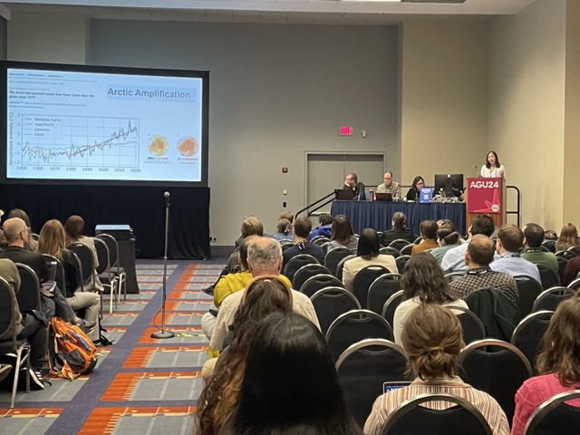

Hi! I'm Shuyu, a PhD candidate in Geography and NASA [FINESST](https://www.psu.edu/news/earth-and-mineral-sciences/story/geography-student-awarded-nasa-funding-study-harmful-algal-blooms) Graduate Research Fellow at the Pennsylvania State University, advised by [Dr. Kimberly Van Meter](https://www.geog.psu.edu/directory/kimberly-van-meter). I am expected to graduate in Summer 2025. Before my PhD study, I obtained my MSE in Water Resources Engineering from Johns Hopkins University and BS in Hydraulic and Hydropower Engineering with Highest Honours from the China Agricultural University. Here is my [CV](https://schanghydro.github.io/files/chang-cv.pdf).

In my research, I strive to produce datasets and develop both process-based models and data-driven approaches to better quantify and enhance our understanding of the interactions and dynamics between hydrology and biogeochemistry, with the goal of supporting decision-making regarding water resources at various scales.

## Selected Publications
- **Chang, S. Y.**, Schwenk, J., Solander, K. (2025). Deep Learning Advances Arctic River Water Temperature Predictions. *Water Resources Research*, *61*(6), 039053. [[DOI: 10.1029/2024WR039053](https://doi.org/10.1029/2024WR039053)]
- **Chang, S. Y.**, Zhang, Q., Byrnes, D. K., Basu, N. B., & Van Meter, K. J. (2021). Chesapeake legacies: The importance of legacy nitrogen to improving Chesapeake Bay water quality. *Environmental Research Letters*, *16*(8), 085002.  [[DOI: 10.1088/1748-9326/ac0d7b](https://iopscience.iop.org/article/10.1088/1748-9326/ac0d7b)]

## News
[Feb 2025] I was awraded the AGU'24 Outstanding Student Presentation Award (OSPA). Checkout our paper here ~ [[DOI: 10.1029/2024WR039053](https://doi.org/10.1029/2024WR039053) 🥳

[Feb 2025] I attended and delivered a talk in Chesapeake Bay AI/ML Workshop at the Smithsonian Environmental Research Center (SERC).

[Feb 2025] I delivered a departimental seminar to the Department of Civil & Environmental Engineering at Penn State.

[Jan 2025] I attended and presented at the American Meteorological Society (AMS) Annual Meeting in New Orleans for the first time. 

[Dec 2024] I went to AGU '24 in Washington DC. I gave an oral presentation and a poster presentation, met old friends, and made new connections! 

[Oct 2024] I visited Franklin & Marshall College and delivered a guest lecture on "Dam and Nutrients in the Chesapeake Bay Watershed" 🎓

[Oct 2024] My first-author paper "The geometry of flow: Advancing predictions of river geometry with multi-model machine learning", accepted to Water Resources Research, is now officially pressed at [[DOI: doi.org/10.1029/2023WR036733](https://doi.org/10.1029/2023WR036733)]

[Oct 2024] My first-author manuscript, titled "Advancing Arctic River Temperature Predictions Using a Deep Learning Approach", is now available as a preprint at [[DOI: 10.22541/au.172745845.52823366/v1](https://doi.org/10.22541/au.172745845.52823366/v1)]

[Jun 2024] I served as the science lead and co-organized with Dr. Kimberly Van Meter the [Chesapeake Water Summer Institute](https://www.psu.edu/news/earth-and-mineral-sciences/story/wetlands-water-quality-chesapeake-bay-focus-van-meter-nsf-career) at the Pennsylvania State University. This two-week summer institute has successfully concluded. Our students gave a talk at the Chesapeake Community Research Symposium '24, in Annapolis, MD. Thanks everyone!

[Hello World] Woo-hoo! Setting up my first personal website 🥳.

