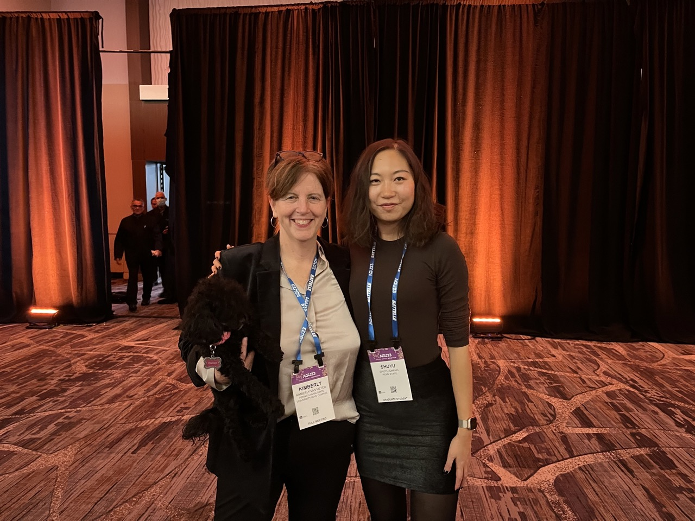
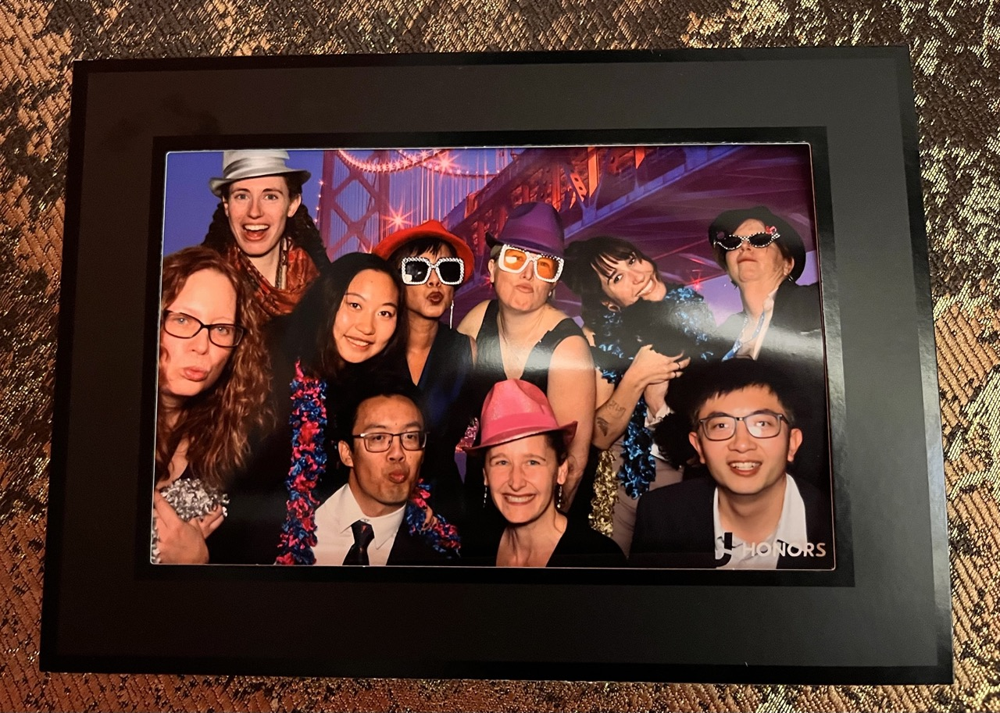
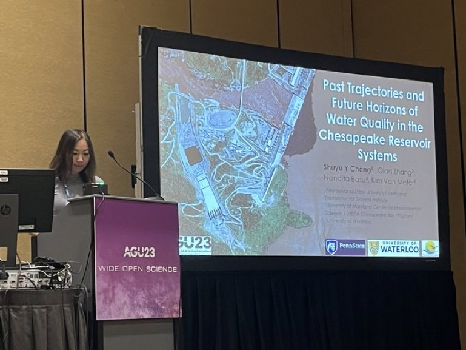
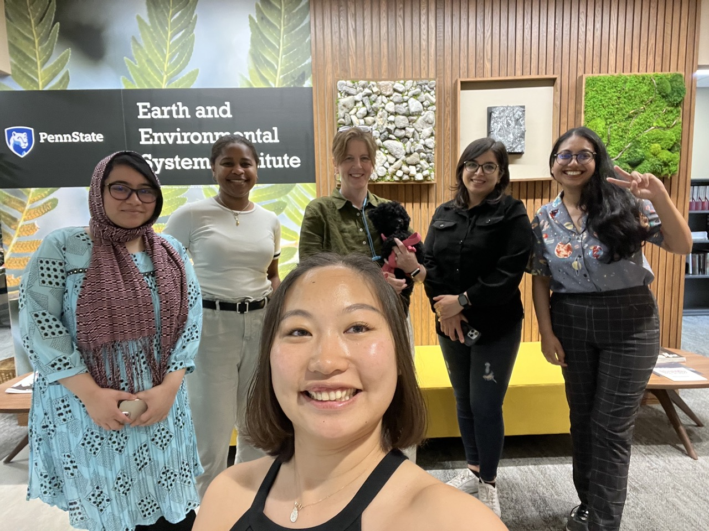
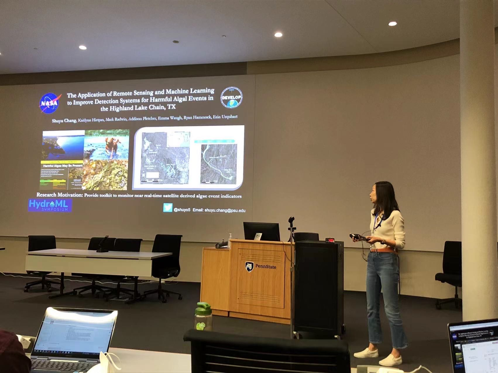
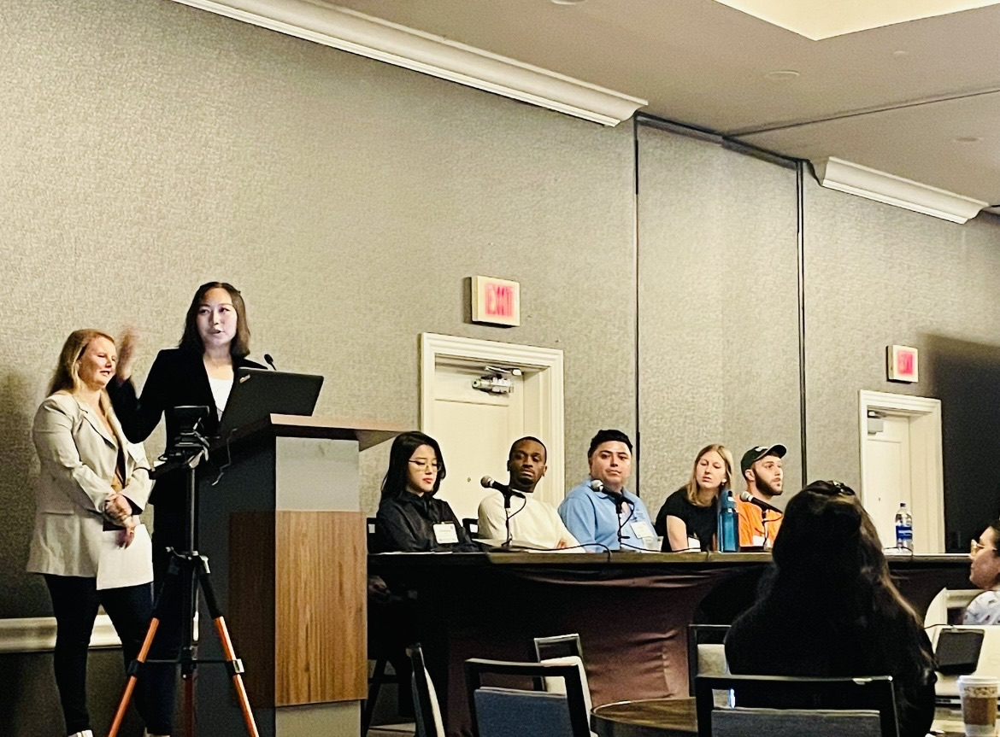
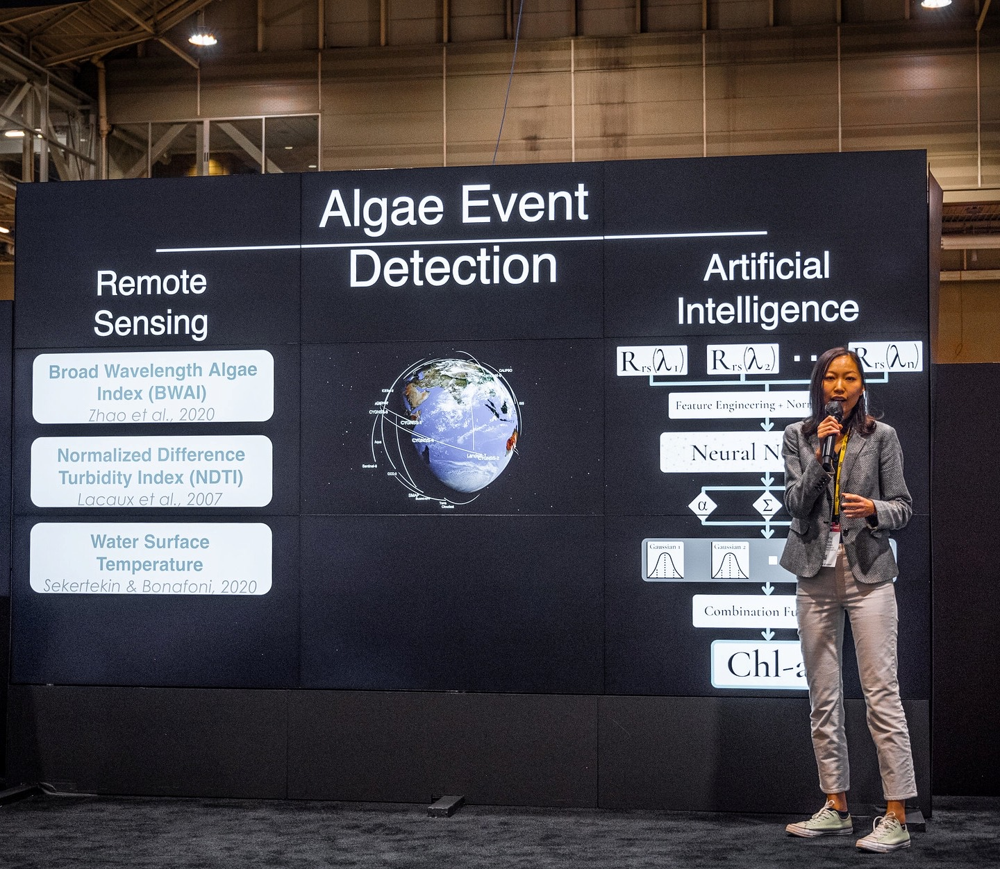
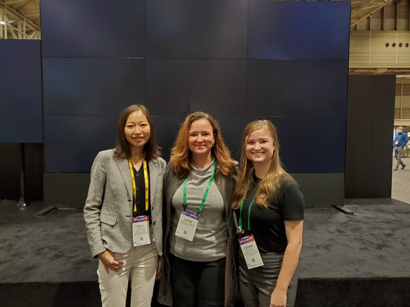

  

  

  

 

# Featured in Media

- Shuyu’s research was funded by the Illinois-Indiana Scholar program. *IISG news*.  
  Available at: [https://iiseagrant.org/meet-our-grad-student-scholars-shuyu-chang/](https://iiseagrant.org/meet-our-grad-student-scholars-shuyu-chang/)

- Shuyu’s research was introduced by the AGU Ecohydrology post. *AGU Ecohydrology Blog*.  
  Available at: [https://www.aguecohydrology.org/blog-adding-our-leaves/meet-a-leaf-shuyu-chang](https://www.aguecohydrology.org/blog-adding-our-leaves/meet-a-leaf-shuyu-chang)

- Shuyu’s research was awarded the NASA FINESST. *Penn State news*.  
  Available at: [https://sc-cms.psu.edu/earth-and-mineral-sciences/story/geography-student-awarded-nasa-funding-study-harmful-algal-blooms](https://sc-cms.psu.edu/earth-and-mineral-sciences/story/geography-student-awarded-nasa-funding-study-harmful-algal-blooms)

- Shuyu’s research was awarded the UIC Provost’s Graduate Research Award. *UIC news*.  
  Available at: [https://eaes.uic.edu/news-stories/shuyu-chang-selected-for-a-uic-provosts-graduate-research-award/](https://eaes.uic.edu/news-stories/shuyu-chang-selected-for-a-uic-provosts-graduate-research-award/)

- Shuyu’s proposal was funded by the EESI Marilyn L. Fogel Student Research Fund in Biogeosciences. *PSU EESI news*.  
  Available at: [https://www.eesi.psu.edu/news/news-archive-2021-institute-names-inaugural-recipients-marilyn-l-fogel-fund](https://www.eesi.psu.edu/news/news-archive-2021-institute-names-inaugural-recipients-marilyn-l-fogel-fund)

- Shuyu and her Chesapeake ELEMeNT-N work was featured at the CCMP. *CCMP newsletter*.  
  Available at: [https://mailchi.mp/77fbc6ce5631/ccmp-newsletter-december-6114474?e=926687c614](https://mailchi.mp/77fbc6ce5631/ccmp-newsletter-december-6114474?e=926687c614)
